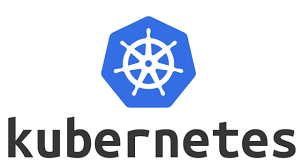

# Kubernetes                                                                                                                           

**Kubernetes** (often abbreviated as **K8s**) is an open-source **container orchestration** platform for automating the deployment, scaling, and management of containerized applications. Originally developed by Google, Kubernetes has become one of the most widely adopted platforms for managing containers in production environments.

Here's a deep dive into **what Kubernetes is**, **how it works**, and **why it’s used**:

---

### **Key Concepts of Kubernetes**

1. **Containers**:
   Kubernetes is built to manage **containerized applications**, which are lightweight, portable, and easy-to-deploy units that include both the application and all of its dependencies. Containers allow you to package an app and run it consistently across different environments, whether on a developer's laptop, in the cloud, or on a server.

2. **Container Orchestration**:
   While containers are great for packaging applications, managing them in large-scale environments (like a production system) can become complex. Kubernetes solves this problem by automating tasks such as:

   * Deployment of containers
   * Scaling containers up or down
   * Load balancing and service discovery
   * Managing updates and rollbacks
   * Ensuring that the desired state of your system is always met

3. **Kubernetes Cluster**:
   A Kubernetes **cluster** is made up of two main components:

   * **Control Plane**: The set of components that manage the overall system, including the API server, scheduler, controller manager, and etcd (key-value store).
   * **Nodes**: The physical or virtual machines that run the applications in containers. Each node runs at least one container runtime (like Docker or containerd), as well as a kubelet (which manages the node’s containers) and a kube-proxy (which handles network routing).

---

### **Core Components of Kubernetes**

1. **Pods**:
   A **Pod** is the smallest deployable unit in Kubernetes. It represents one or more containers that are tightly coupled and share the same network namespace. Pods can hold a single container or multiple containers that need to share resources like networking and storage. Most applications are deployed in a single container per pod, but complex applications may use multi-container pods for tighter coupling between containers.

   Example: You might have a pod with two containers—one running a web server and another running a logging service.

2. **Services**:
   A **Service** in Kubernetes defines a logical set of pods and a policy by which to access them. Services ensure that your app is discoverable and reachable from other parts of the system, even if individual pods are created or destroyed dynamically.

   Types of Services:

   * **ClusterIP** (default): Exposes the service on a cluster-internal IP.
   * **NodePort**: Exposes the service on a specific port on each node in the cluster.
   * **LoadBalancer**: Exposes the service externally via a load balancer (usually used with cloud providers like AWS, Azure).
   * **ExternalName**: Maps the service to an external DNS name.

3. **Deployments**:
   A **Deployment** is a Kubernetes object that manages the deployment of pods. It ensures that the specified number of pods are always running, and provides features like:

   * Rolling updates: Upgrading applications without downtime.
   * Rollbacks: Reverting to a previous version if something goes wrong.
   * Scaling: Increasing or decreasing the number of replicas of the application.

4. **ReplicaSets**:
   A **ReplicaSet** is responsible for ensuring that a specified number of pod replicas are running at any given time. In practice, you usually interact with **Deployments** instead of directly with ReplicaSets, as deployments manage them for you.

5. **StatefulSets**:
   A **StatefulSet** is used for managing **stateful applications** that require persistent storage and consistent network identifiers (e.g., databases). It ensures that each pod in the set has a unique, stable identity, making it suitable for applications that rely on stable, persistent storage and/or need specific network addresses.

6. **Namespaces**:
   **Namespaces** allow you to partition your cluster into multiple virtual clusters. They are useful for organizing resources, especially in larger environments with many teams or projects. Namespaces can be used to isolate resources, manage access controls, and apply policies in a more structured way.

7. **Volumes**:
   A **Volume** in Kubernetes is a storage resource that can be attached to a pod. Volumes provide a way for containers to persist data beyond the lifecycle of individual containers. Kubernetes supports different types of volumes, including local storage, cloud storage (like AWS EBS, Google Cloud Persistent Disk), and network file systems.

8. **Ingress**:
   An **Ingress** is a collection of rules that allow external HTTP/S traffic to reach the services in your Kubernetes cluster. Ingress controllers manage the traffic and provide features like load balancing, SSL termination, and URL routing.

9. **ConfigMaps and Secrets**:

   * **ConfigMaps** store configuration data (non-sensitive information) that can be used by pods in your cluster.
   * **Secrets** store sensitive data, like API keys, passwords, and certificates. Secrets are typically stored in base64-encoded format and can be referenced by pods securely.

---

### **Kubernetes Control Plane Components**

1. **API Server (kube-apiserver)**:
   The API server is the central management point for all Kubernetes commands and requests. It's the main entry point for interacting with the cluster (via `kubectl` or other tools). It validates and processes API requests and updates the **etcd** database.

2. **Scheduler (kube-scheduler)**:
   The scheduler watches for newly created pods that have no node assigned, and selects a node for them to run on based on resource requirements, constraints, and availability.

3. **Controller Manager (kube-controller-manager)**:
   The controller manager is responsible for running controller processes in the cluster. These controllers handle routine tasks like ensuring the desired state of the system, managing replica sets, and scaling applications.

4. **etcd**:
   **etcd** is a highly-available key-value store that stores the state of the Kubernetes cluster, including all the configuration data, secrets, and state information about nodes, pods, and services.

5. **Cloud Controller Manager**:
   The cloud controller manager allows Kubernetes to interact with the underlying cloud infrastructure (e.g., managing load balancers, storage, and instances) if you're running on a cloud provider.

---

### **Why Use Kubernetes?**

1. **Scalability**:
   Kubernetes enables horizontal scaling, meaning you can scale your applications up or down by adding or removing container instances (pods). It also automatically handles load balancing to ensure that traffic is evenly distributed across pods.

2. **High Availability**:
   Kubernetes automatically ensures that your application is highly available by running multiple replicas of each pod and distributing them across nodes. If one node fails, Kubernetes will reschedule pods on healthy nodes.

3. **Automated Rollouts and Rollbacks**:
   Kubernetes can automate the process of updating your applications, ensuring that new versions are rolled out with minimal downtime. If something goes wrong, it allows you to easily roll back to a previous stable version.

4. **Self-healing**:
   Kubernetes continuously monitors the health of your applications and automatically restarts or reschedules containers if they fail. It also kills containers that do not respond to health checks.

5. **Declarative Configuration**:
   Kubernetes uses a declarative approach to configuration. You simply define the desired state of your system (e.g., number of replicas, resources, networking rules), and Kubernetes ensures that the current state matches that definition.

6. **Multi-cloud and Hybrid Cloud Support**:
   Kubernetes abstracts away the underlying infrastructure, allowing you to run applications on any cloud provider (AWS, GCP, Azure) or on-premise. It provides a consistent API and experience across different environments.

---

### **Common Use Cases for Kubernetes**

1. **Microservices**:
   Kubernetes is widely used to manage microservices-based architectures, where each service is deployed in its own container. Kubernetes helps with managing dependencies, scaling, and providing networking for these distributed services.

2. **CI/CD Pipelines**:
   Kubernetes is often used in Continuous Integration/Continuous Deployment (CI/CD) workflows, where it automates the deployment, scaling, and testing of applications in a controlled environment.

3. **Multi-Cloud and Hybrid Cloud Environments**:
   Organizations often use Kubernetes to manage applications across multiple cloud providers or hybrid environments. Kubernetes abstracts away infrastructure details, making it easier to move workloads across clouds.

4. **Big Data and Machine Learning**:
   Kubernetes can be used to deploy and scale big data and machine learning workloads, such as Apache Spark, TensorFlow, or Jupyter notebooks, across clusters of machines.

---

### **Kubernetes vs Docker** (Clarification)

While Kubernetes and **Docker** are often mentioned together, they serve different purposes:

* **Docker** is a containerization platform that packages applications and their dependencies into containers.
* **Kubernetes** is a container orchestration platform that helps you manage the deployment, scaling, and operation of these containers across clusters of machines.

In short, **Docker** creates the containers, and **Kubernetes** manages those containers.

---

Kubernetes can seem complex at first, but once you understand its components and the problems it solves, it becomes a powerful tool for managing containerized applications in large-scale environments. Let me know if you'd like more details on any specific part of Kubernetes or how to get started with it!
